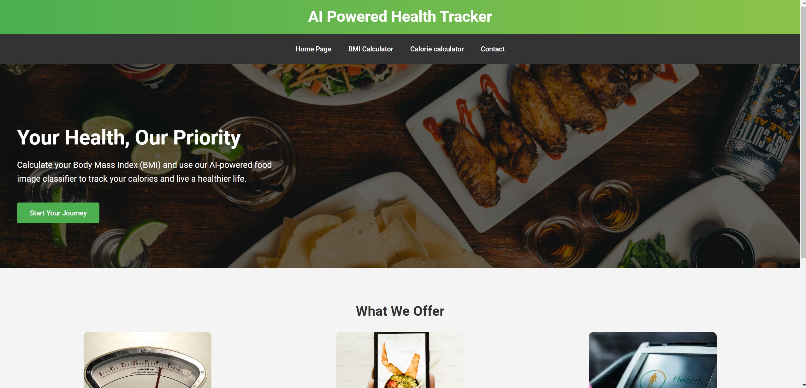
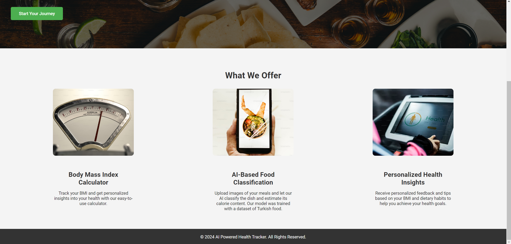
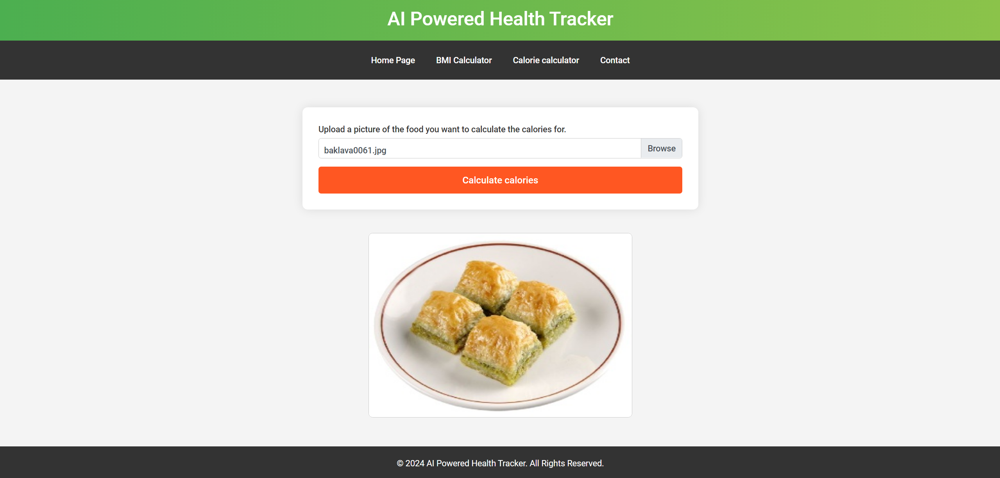
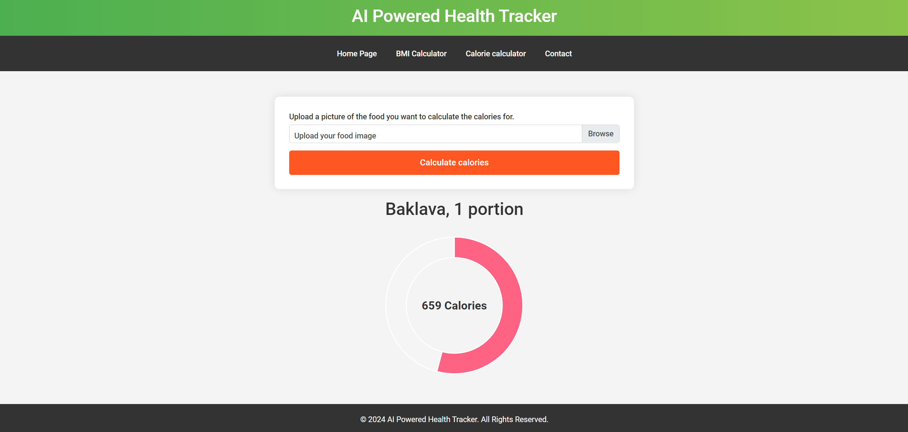
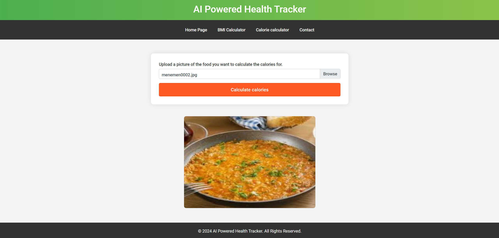
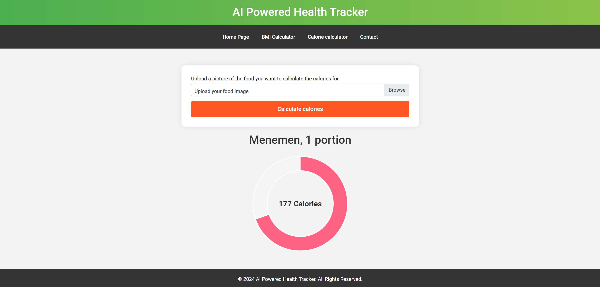
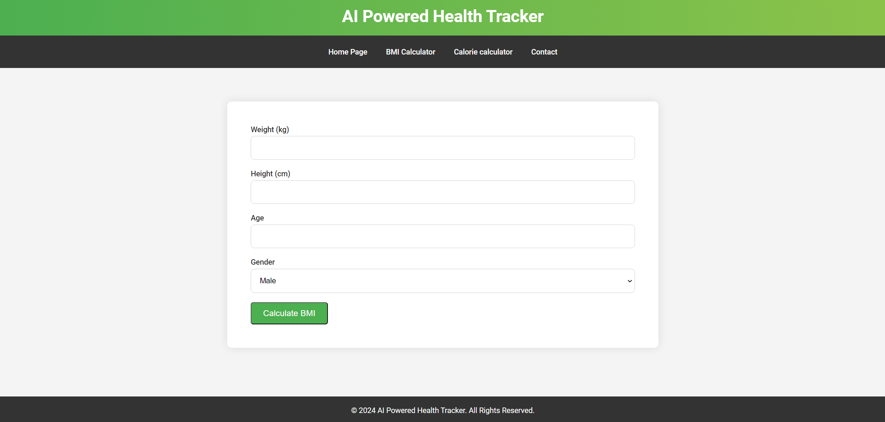
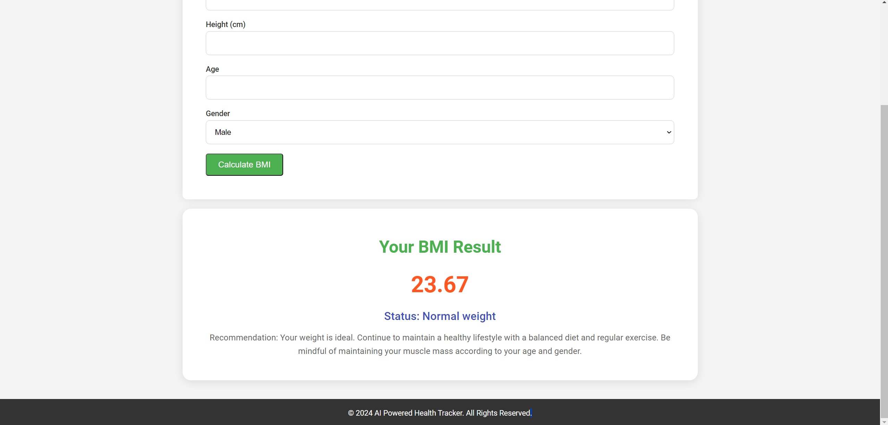
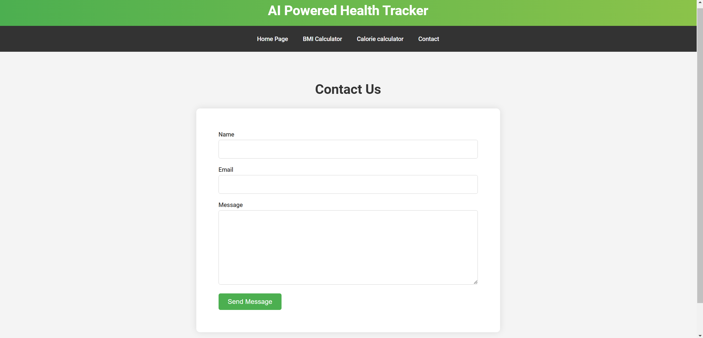

# 🍽️ Turkish Food Calorie & BMI Calculator

### A comprehensive web application utilizing deep learning to classify Turkish food images and calculate nutritional information.

[](https://www.djangoproject.com/)
[](https://www.tensorflow.org/)
[](https://keras.io/api/applications/mobilenet/)
[](https://www.python.org/)
[](LICENSE)

---

## 📜 Overview

This project harnesses the power of deep learning to create an interactive web application that provides users with:

- **Food Classification**: Classifies Turkish dishes from user-uploaded images.
- **Calorie Information**: Retrieves calorie content using web scraping techniques.
- **BMI Calculator**: Calculates the Body Mass Index (BMI) and offers personalized health advice based on user input.

---

## 🔍 Key Features

- 🖼️ **Food Image Classification**: Accurately classifies a wide variety of Turkish dishes into **81 distinct categories** using a pre-trained MobileNetV2 model.
  
- 🧮 **Caloric Analysis**: Displays the calorie count of the classified dish through a visually appealing circular graph.

- ⚖️ **BMI Calculation**: Users can input their age, weight, height, and gender to receive tailored feedback about their health.

- 📬 **Contact Form**: Easily reach out for inquiries, feedback, or support.

---

## 📸 Screenshots

### Homepage
  <!-- Add an image relevant to your project -->

<br>

<br>

  <!-- Add an image relevant to your project -->

### Calorie Calculator
  <!-- Add an image relevant to your project -->
<br>

<br>
  <!-- Add an image relevant to your project -->
<br>

<br>
  <!-- Add an image relevant to your project -->
<br>

<br>
  <!-- Add an image relevant to your project -->

### BMI Calculator
  <!-- Add an image relevant to your project -->

<br>

<br>

  <!-- Add an image relevant to your project -->

### Contact Page
  <!-- Add an image relevant to your project -->

---

## 🔧 Installation Guide

To set up this project locally, follow these steps:

1. **Clone the repository:**
   ```bash
   git clone https://github.com/HasanCan6241/AIFoodTracker.git
   cd AIFoodTracker
